<p align='center'>
  
</p>

## MakeAwish

* About the project: MakeAwish is a birthday reminder app where users can share their birthday gift wishes to friends and family.
* Planning before coding: <a href='https://github.com/Kimi-Zou/capstone-make-a-wish/wiki'>MakeAwish wiki docs</a>
* View live: <a href='https://capstone-make-a-wish.herokuapp.com/'>MakeAwish live app</a>

<br />

## Table of Contents

  * [Technologies Used](#technologies-used)
  * [Installation](#installation)
  * [Featrues](#features)
  * [Contact](#contact)

<br />

## Technologies Used

  * Languages: 
  * Frontend: 
     
    
    
    
  * Backend:
     
    
    
    
  * Frameworks and Libraries: 
    

<br />

## Installation

1. Install packages for frontend and backend
```
cd frontend/
npm install
```
```
cd backend/ 
npm install
```
2. Start backend server
```
cd backend/
npm start
```
3. Start frontend server
```
cd frontend/
npm start
```
<br />

## Features

Login and Signup
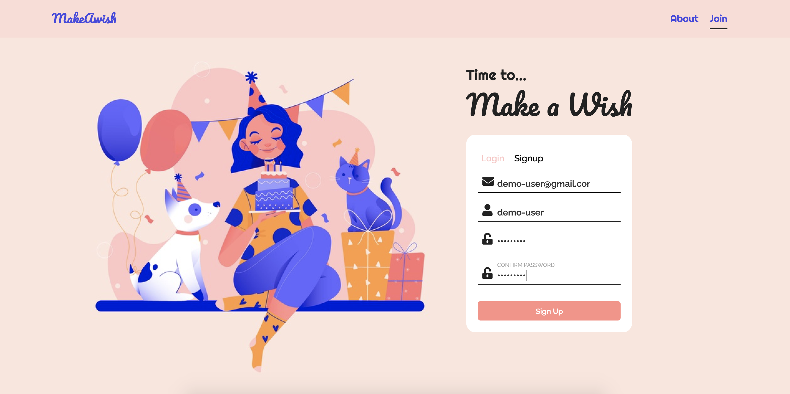
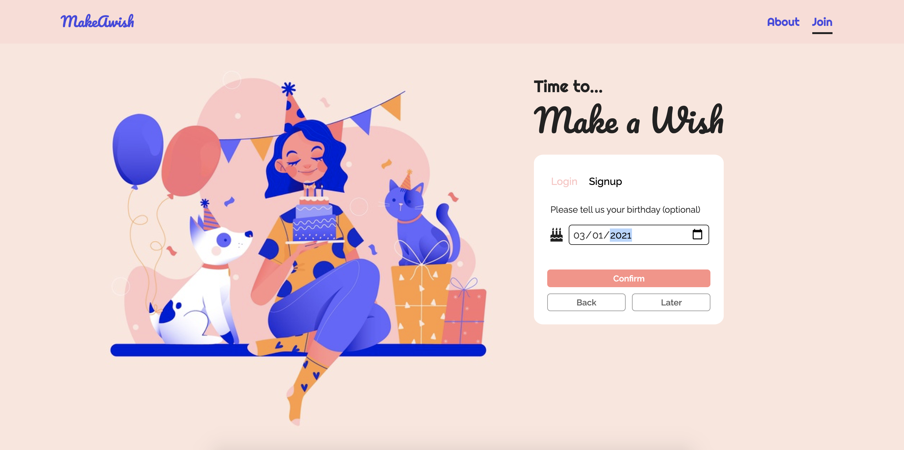
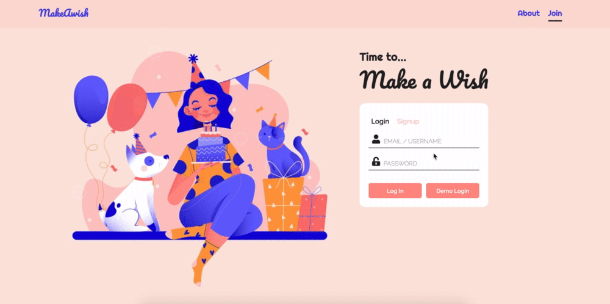

<br />

View Friends
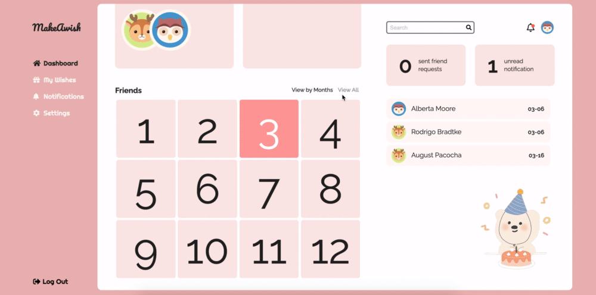

<br />

View Friend's Wishes
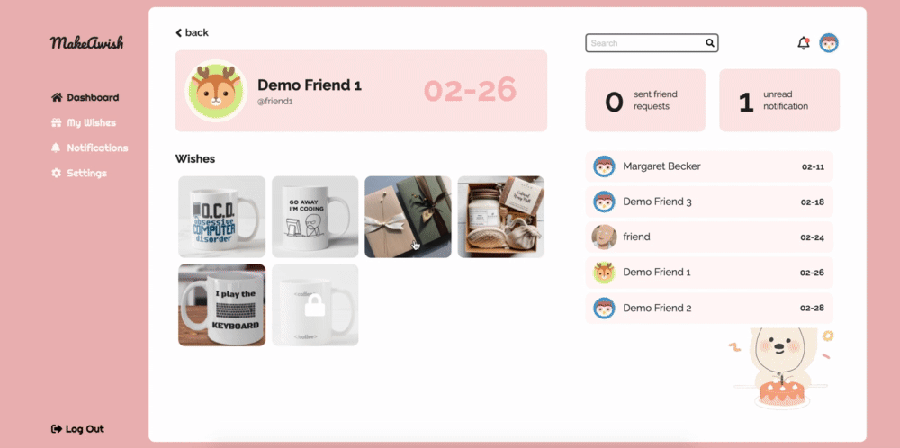

<br />

Keep Track of Gifts Preparation


<br />

Create a Wish
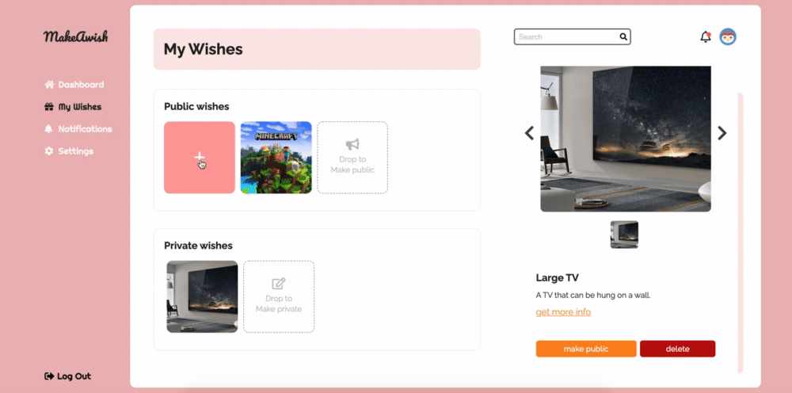
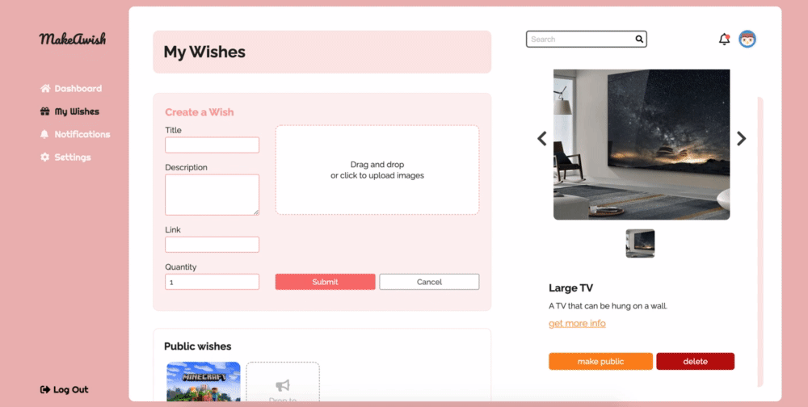

<br />

Manage My Wishes
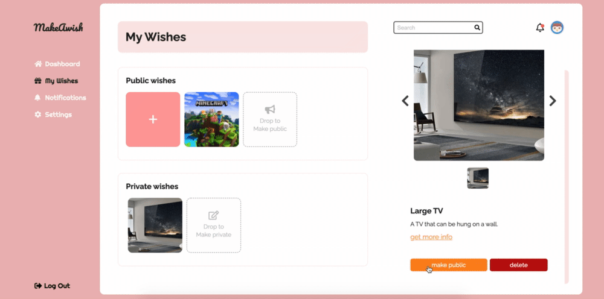

<br />

Search and Add Friends
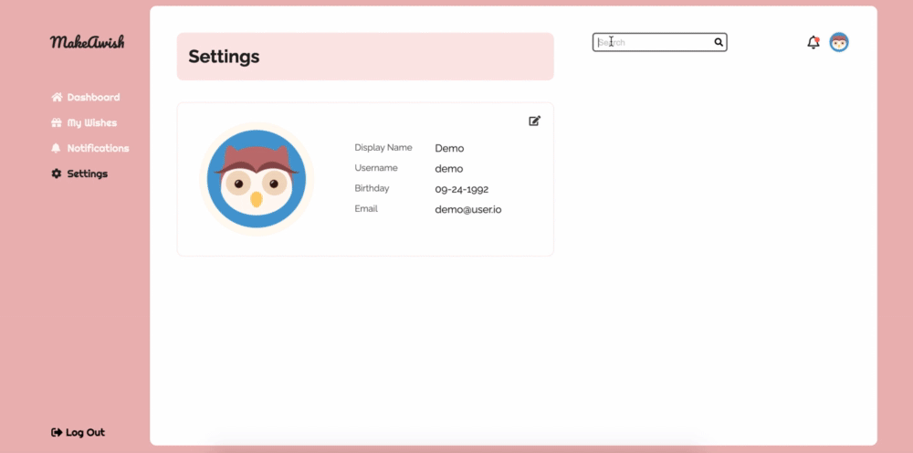

<br />

Notifications
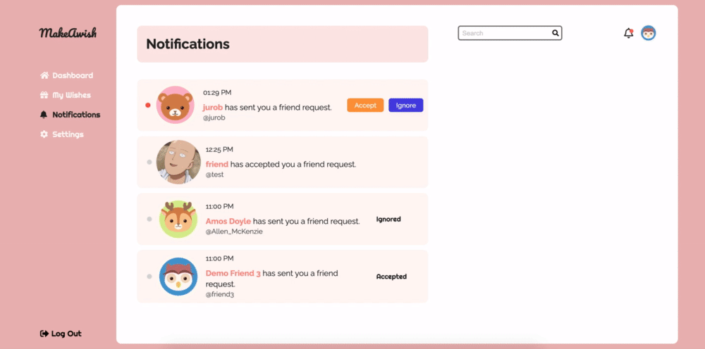

<br />

Settings
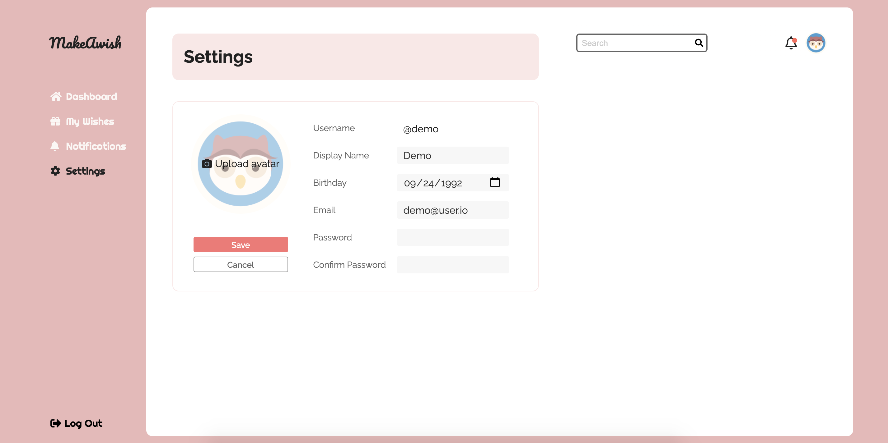

<br />

## Contact

* Email: [Kimi Zou](mailto:kimizou.kz@gmail.com)
* LinkedIn: [LinkedIn Profile - Kimi Zou](https://www.linkedin.com/in/kimizou/)
* AngelList: [AngelList Profile - Kimi Zou](https://angel.co/u/kimi-zou)
* Github: [Github Profile - Kimi Zou](https://github.com/Kimi-Zou)